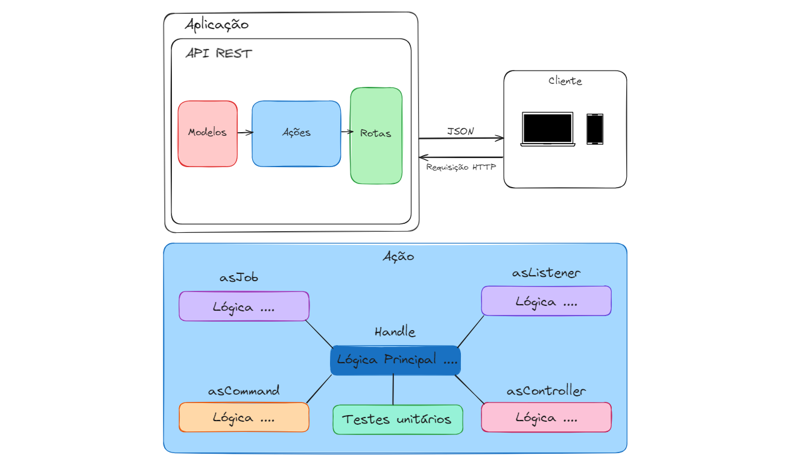

# <p style="text-align: center;">Gerador de corridas (API)🚖</p>

## 🔍 Sobre

API REST para sistema de geração de corridas


## 🔌 Como Executar o Projeto

Antes de começar, certifique-se de ter um ambiente Docker/Docker-Compose instalado 

Para executar o projeto, siga os seguintes passos:

1. Abra o projeto com o Editor/IDE de sua preferência


2. Faça o download das dependências do projeto. Esse projeto utiliza o Laravel Sail para gerenciar os containers e caso o projeto esteja recém-clonado você deverá executar o seguinte comando para instalar as dependências pela primeira vez
    ```
       docker run --rm --interactive --tty -v $(pwd):/app composer install
    ```

3. Em seguida, você deve executar o comando:
    ```
       ./vendor/bin/sail up -d 
    ```
   esse comando irá subir os containers da aplicação (servidor web, banco de dados, redis, etc)


4. Agora você deve ajustar sua .env (faça uma cópia da .env.example, não necessário nenhuma alteração) e executar os seguintes comandos:
    ```
        touch database/database.sqlite
    ```
    ```
        php artisan key:generate
    ```
    ```
        php artisan migrate
    ```
    ```
        php artisan db:seed
    ```
    Os comandos acima criam o arquivo do banco SQLite, gera a chave da aplicação, executa as migrações do banco de dados e semeia o banco com dados iniciais, Respectivamente.

## 🔨 Testando a API 
 1. O projeto possui Swagger e Swagger UI para testar os enpoints. Para utiliza-los basta executar o comando:
    ```
    php artisan l5-swagger:generate 
    ```
    Após executar o comando acima basta acessar a rota `/api/documentation`
2. O projeto também possui testes automatizados 

## 📏  Aquitetura, padrões e bibliotecas utilizadas 
A aplicação utiliza o framework Laravel com a bibliotedca Laravel Actions. Essa biblioteca traz uma forma de escrever a lógica da aplicação encapsulando uma lógica bem definida dentro de uma classe que pode servir como Controller, Command, Listener ou Job do Laravel. esse padrão é baseado no Command Pattern da GoF (Gang of Four). Esse padrão também é altamente testável já que seu conceito é bem amigável ao conceito de testes unitários.


 - [x] Utilização da biblioteca `DarkaOnLine/L5-Swagger` para documentação da API com Swagger e Swagger UI 
 - [x] Utilização da biblioteca `lorisleiva/laravel-actions` como padrão de arquitetura da aplicação
 - [x] PHPUnit para testes unitários
## 💻 Tecnologias


